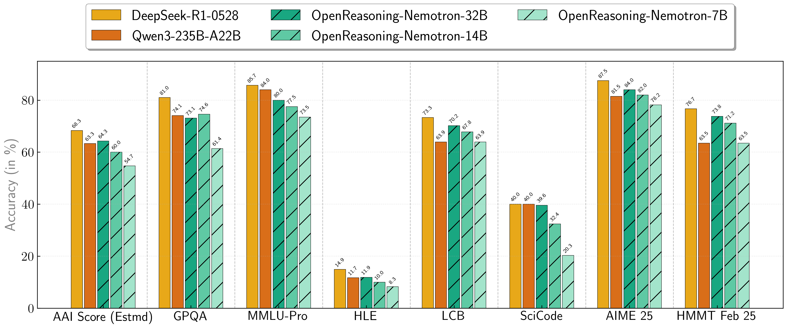
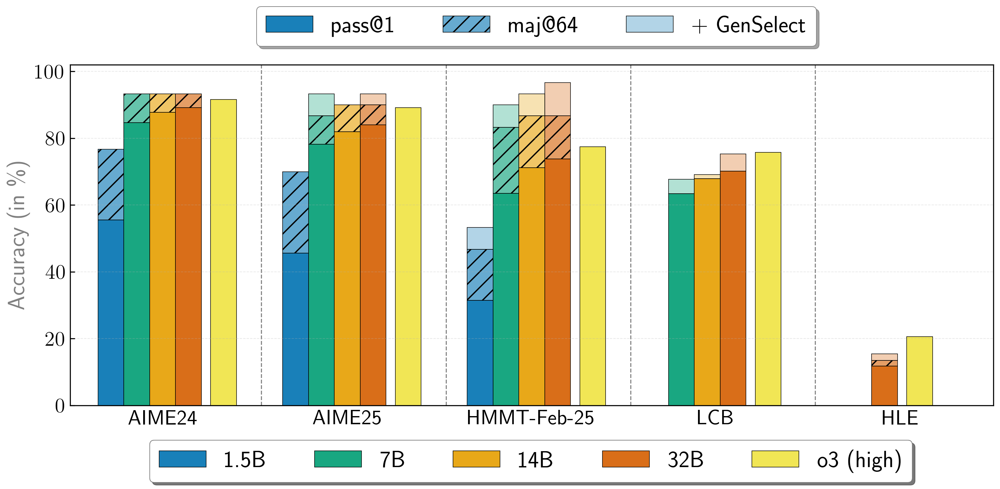

# NeMo Skills

NeMo-Skills is a collection of pipelines to improve "skills" of large language models (LLMs). We support everything needed for LLM development, from synthetic data generation, to model training, to evaluation on a wide range of benchmarks. Start developing on a local workstation and move to a large-scale Slurm cluster with just a one-line change.

Here are some of the features we support:

- [Flexible LLM inference](https://nvidia.github.io/NeMo-Skills/pipelines/generation/):
  - Seamlessly switch between API providers, local server and large-scale slurm jobs for LLM inference.
  - Host models (on 1 or many nodes) with [TensorRT-LLM](https://github.com/NVIDIA/TensorRT-LLM), [vLLM](https://github.com/vllm-project/vllm), [sglang](https://github.com/sgl-project/sglang) or [Megatron](https://github.com/NVIDIA/Megatron-LM).
  - Scale SDG jobs from 1 GPU on a local machine all the way to tens of thousands of GPUs on a slurm cluster.
- [Model evaluation](https://nvidia.github.io/NeMo-Skills/pipelines/evaluation):
  - Evaluate your models on many popular benchmarks.
    - Math problem solving: hmmt_feb25, brumo25, aime24, aime25, omni-math (and many more)
    - Formal proofs in Lean: minif2f, proofnet
    - Coding skills: swe-bench, scicode, livecodebench, human-eval, mbpp
    - Chat/instruction following: ifbench, ifeval, arena-hard
    - General knowledge: mmlu, mmlu-pro, gpqa
    - Long context: ruler, mrcr
  - Easily parallelize each evaluation across many slurm jobs, self-host LLM judges, bring your own prompts or change benchmark configuration in any other way.
- [Model training](https://nvidia.github.io/NeMo-Skills/pipelines/training): Train models using [NeMo-Aligner](https://github.com/NVIDIA/NeMo-Aligner/), [NeMo-RL](https://github.com/NVIDIA/NeMo-RL/) or [verl](https://github.com/volcengine/verl).

## News

* [07/30/2025]: The datasets used to train OpenReasoning models are released! Math and code are available as part of [Nemotron-Post-Training-Dataset-v1](https://huggingface.co/datasets/nvidia/Nemotron-Post-Training-Dataset-v1) and science is available in
[OpenScienceReasoning-2](https://huggingface.co/datasets/nvidia/OpenScienceReasoning-2).
See our [documentation](https://nvidia.github.io/NeMo-Skills/releases/openreasoning/training) for more details.

* [07/18/2025]: We released [OpenReasoning](https://nvidia.github.io/NeMo-Skills/releases/openreasoning/) models! SOTA scores on math, coding and science benchmarks.

* [04/23/2025]: We released [OpenMathReasoning](https://nvidia.github.io/NeMo-Skills/openmathreasoning1) dataset and models!

  * OpenMathReasoning dataset has 306K unique mathematical problems sourced from [AoPS forums](https://artofproblemsolving.com/community) with:
      * 3.2M long chain-of-thought (CoT) solutions
      * 1.7M long tool-integrated reasoning (TIR) solutions
      * 566K samples that select the most promising solution out of many candidates (GenSelect)
  * OpenMath-Nemotron models are SoTA open-weight models on math reasoning benchmarks at the time of release!

* [10/03/2024]: We released [OpenMathInstruct-2](https://nvidia.github.io/NeMo-Skills/openmathinstruct2) dataset and models!

  * OpenMathInstruct-2 is a math instruction tuning dataset with 14M problem-solution pairs generated using the Llama3.1-405B-Instruct model.
  * OpenMath-2-Llama models show significant improvements compared to their Llama3.1-Instruct counterparts.

## Getting started

To get started, follow these [steps](https://nvidia.github.io/NeMo-Skills/basics),
browse available [pipelines](https://nvidia.github.io/NeMo-Skills/pipelines) or run `ns --help` to see all available
commands and their options.

You can find more examples of how to use NeMo-Skills in the [tutorials](https://nvidia.github.io/NeMo-Skills/tutorials) page.

We've built and released many popular models and datasets using NeMo-Skills. See all of them in the [Papers & Releases](./releases/index.md) documentation.

You can find the full documentation [here](https://nvidia.github.io/NeMo-Skills/).

## Contributing

We welcome contributions to NeMo-Skills! Please see our [Contributing Guidelines](./CONTRIBUTING.md) for more information on how to get involved.

Disclaimer: This project is strictly for research purposes, and not an official product from NVIDIA.
